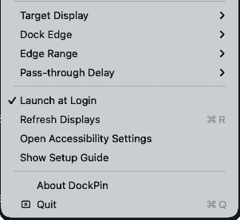

# DockPin

[](https://github.com/kangaroo-demo/DockPin/releases/latest)
[](https://github.com/kangaroo-demo/DockPin/releases/latest/download/DockPin.zip)


[](LICENSE)

DockPin is a free, open-source macOS menu bar utility for multi-monitor Dock control. It helps keep the macOS Dock on a target display while the app is running.

It is built for multiple-display setups where the Dock keeps moving to the wrong monitor, especially vertical layouts where one display sits above another.

[Download DockPin.zip](https://github.com/kangaroo-demo/DockPin/releases/latest/download/DockPin.zip) · [All Releases](https://github.com/kangaroo-demo/DockPin/releases)

[简体中文文档](README.zh-CN.md)

## What It Does

- Runs as a lightweight menu bar app.
- Lets you choose the target display.
- Supports bottom, left, and right Dock edges.
- Uses a soft pointer gate near the chosen display edge so the Dock stays on the intended display while normal cross-display movement remains possible.
- Restores the Dock to the system default outer display edge when you quit DockPin.
- Lets you tune edge range and pass-through delay.
- Supports Launch at Login.
- Includes a first-run setup guide for Gatekeeper and Accessibility permission.
- Supports English and Simplified Chinese UI.

Common search terms: macOS Dock utility, multi-monitor Dock fix, multiple displays, menu bar app, Swift, AppKit.

## What It Does Not Do

macOS does not expose a public API for directly assigning the Dock to a specific display. DockPin does not patch the Dock, modify system files, inject code into Dock, or use private APIs.

DockPin works by using a Quartz event tap and Accessibility permission to gently clamp pointer movement near the chosen Dock edge. This helps macOS treat that display edge as the Dock edge.

## Install

Download the latest [`DockPin.zip`](https://github.com/kangaroo-demo/DockPin/releases/latest/download/DockPin.zip), unzip it, and move `DockPin.app` to `/Applications`.

On first launch:

1. Open `DockPin.app`.
2. Grant Accessibility permission when macOS asks.
3. If the menu shows `Accessibility Needed`, open `System Settings -> Privacy & Security -> Accessibility`, enable DockPin, then restart DockPin.

### If macOS Says It Cannot Verify DockPin

Current community builds may be unsigned or not notarized unless the maintainer has configured Apple Developer ID signing. If macOS shows `Apple could not verify "DockPin"`:

1. Click `Done`, not `Move to Trash`.
2. Open `System Settings -> Privacy & Security`.
3. In the Security section, click `Open Anyway` for DockPin.
4. Open DockPin again and choose `Open`.

You can also build DockPin from source to avoid downloading a quarantined app bundle.

## Usage

Click `DockPin` in the menu bar.



- `Target Display`: choose the display that should own the Dock behavior while DockPin is running.
- `Dock Edge`: choose bottom, left, or right.
- Changing `Dock Edge` also changes the macOS Dock position.
- `Edge Range`: choose how much of that edge DockPin watches.
- `Pass-through Delay`: choose how long DockPin waits before letting the pointer pass through to another display.
- `Launch at Login`: start DockPin automatically after login.
- Hold `Option` while crossing the watched edge to bypass the gate immediately.

Opening DockPin applies the selected display behavior automatically. Quitting DockPin stops the event tap and nudges the Dock back to the system's default outer display edge.

## Recommended Settings

For a top external display with a built-in display below it:

- Target Display: external display
- Dock Edge: Bottom
- Edge Range: 40%
- Pass-through Delay: 0.20s

## Build From Source

Requirements:

- macOS 13 or later
- Xcode Command Line Tools
- Swift 5.9 or later

Build and package:

```sh
git clone git@github.com:kangaroo-demo/DockPin.git
cd DockPin
./scripts/package_release.sh
open dist/DockPin.app
```

List displays without launching the menu bar app:

```sh
swift run DockPin --list-displays
```

## Release

Push a version tag to create a GitHub Release automatically:

```sh
git tag -a v0.1.8 -m "DockPin 0.1.8"
git push origin v0.1.8
```

The release workflow builds `dist/DockPin.zip` on macOS and uploads it to the release. It also supports Developer ID signing and notarization when Apple Developer secrets are configured. See [Signing and Notarization](docs/SIGNING_AND_NOTARIZATION.md).

## Privacy

DockPin does not collect analytics, make network requests, or store personal data. Settings are stored locally with `UserDefaults`.

Accessibility permission is used only so DockPin can observe pointer movement and apply the soft edge gate.

## Troubleshooting

### The menu says Accessibility Needed

Enable DockPin in `System Settings -> Privacy & Security -> Accessibility`, then quit and reopen DockPin.

### The Dock still moves to the wrong display

Try increasing `Edge Range` or `Pass-through Delay`. Also confirm the selected `Dock Edge` matches your macOS Dock position.

For stacked layouts, DockPin activates the nearest exposed part of the target display edge. If another display completely covers the selected edge, macOS may not expose a public way for DockPin to force that edge reliably.

### I cannot move to the other display

Lower `Edge Range`, lower `Pass-through Delay`, cross through an unwatched edge area, or hold `Option` while crossing.

## License

MIT
